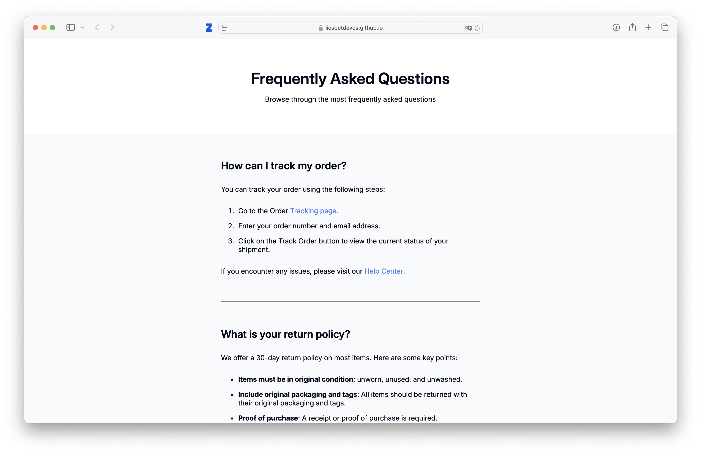

<!-- Please update value in the {}  -->

<h1 align="center">FAQ Page | devChallenges</h1>

   Solution for a challenge <a href="https://devchallenges.io/challenge/simple-faq-challenge" target="_blank">Simple FAQ</a> from <a href="http://devchallenges.io" target="_blank">devChallenges.io</a>.

  <h3>
    <a href="{https://liesbetdevos.github.io/faq-challenge/}">
      Demo
    </a>
     | 
    <a href="{[https://your-url-to-the-solution](https://github.com/liesbetdevos/faq-challenge)}">
      Solution
    </a>
     | 
    <a href="https://devchallenges.io/challenge/simple-faq-challenge">
      Challenge
    </a>
  </h3>

<!-- TABLE OF CONTENTS -->

## Table of Contents

- [Table of Contents](#table-of-contents)
- [Overview](#overview)
  - [What I learned](#what-i-learned)
  - [Useful resources](#useful-resources)
  - [Built with](#built-with)
- [Features](#features)
- [Author](#author)

<!-- OVERVIEW -->

## Overview

During this project, I refreshed some basic html and css concepts, specifically about the box model and the alignment of elements on the page.

### What I learned

I reinforced my knowledge about the box model, more specifically the difference between margin and padding. These elements were important for knowing to keep in mind when setting the background color to make the background span the whole page. 

I also learned more about the meta tags inside the head of an html file and how they can be used to give a description, keywords etc. for the webpage which helps in SEO.

### Useful resources

I used this page from W3 schools to learn more about the meta-tag in HTML:
https://www.w3schools.com/tags/tag_meta.asp

### Built with

<!-- This section should list any major frameworks that you built your project using. Here are a few examples.-->

- Semantic HTML5 markup
- CSS custom properties
- Flexbox

## Features

<!-- List the features of your application or follow the template. Don't share the figma file here :) -->

This application/site was created as a submission to a [DevChallenges](https://devchallenges.io/challenges-dashboard) challenge.

## Author
- GitHub [@liesbet-devos](https://github.com/liesbetdevos)
